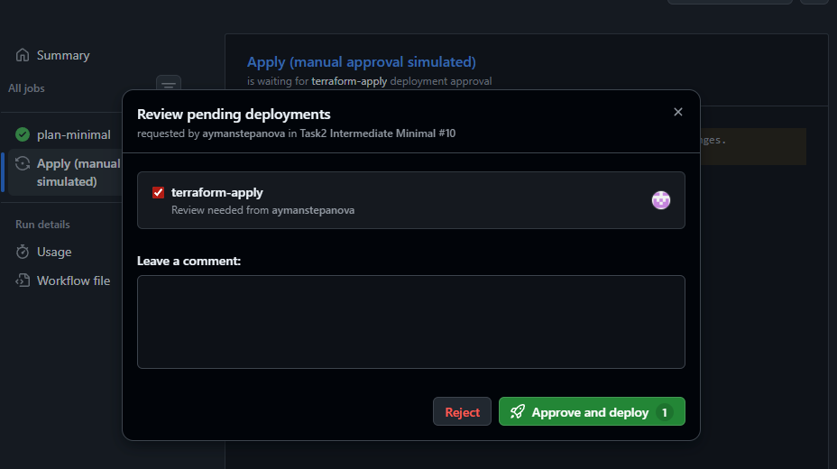

# Task2Advanced — удалённый state (S3 API) и GitHub Actions

Инфраструктура из [Task1Advanced](../Task1Advanced/) разворачивается из отдельных корней Terraform в `envs/{dev,stage,prod}` с **удалённым состоянием** в **S3-совместимом** хранилище (здесь: **Yandex Object Storage**). Модуль ВМ подключается без дублирования кода: `source = "../../../Task1Advanced/modules/vm"`.

CI/CD: `terraform init` → `terraform plan` (артефакт `tfplan`) → `terraform apply` после **ручного подтверждения** (protected environment в GitHub).

Официальное руководство Yandex по state в Object Storage: [Хранение Terraform state в Object Storage](https://cloud.yandex.ru/docs/tutorials/infrastructure-management/terraform-state-storage).

## Структура

```text
architecture-future_pro_2_0/
  ├── .github/
  │   └── workflows/
  │       ├── task2-terraform-plan-apply.yml
  │       └── task2-terraform-destroy.yml
  └── Task2Advanced/
      ├── .gitignore
      ├── README.md
      └── envs/
          ├── dev/
          ├── stage/
          └── prod/
```

В каждом окружении: вызов модуля из Task1, провайдер `yandex`, блок `terraform { backend "s3" {} }`. Параметры backend передаются **только** через файл (например `backend.hcl`) или `-backend-config`, **не** хранятся в git.

Ключи объектов state по умолчанию: `task2/dev/terraform.tfstate`, `task2/stage/terraform.tfstate`, `task2/prod/terraform.tfstate` (тот же бакет, разные ключи).

## Backend (Yandex Object Storage)

1. Создайте бакет и **статические ключи доступа** с правами на запись/чтение объектов в этом бакете (сервисный аккаунт + ключи для S3 API).
2. Скопируйте `backend-config.example` в `backend.hcl` в каталоге нужного окружения и подставьте имя бакета. Файл `backend.hcl` **не коммитится** (см. `.gitignore`).
3. Terraform backend `s3` для Yandex использует endpoint `https://storage.yandexcloud.net` и типичные флаги `skip_*` / `use_path_style` — см. пример в `backend-config.example`.

**Блокировка state:** для параллельных `apply` в одном стеке рекомендуется Terraform **≥ 1.10** и параметр `use_lockfile = true` в backend-конфиге (см. комментарий в `envs/dev/backend-config.example`). В более ранних версиях полагайтесь на ручной `apply` и соглашения команды.

## GitHub Actions

В корне репозитория два workflow:

| Файл | Назначение |
|------|------------|
| [`task2-terraform-plan-apply.yml`](../.github/workflows/task2-terraform-plan-apply.yml) | `terraform init` → `validate` → `plan` (артефакт плана) → **`apply`** после approval среды **`terraform-apply`** |
| [`task2-terraform-destroy.yml`](../.github/workflows/task2-terraform-destroy.yml) | `terraform init` → **`destroy -auto-approve`** после approval среды **`terraform-apply`** |

**Plan / apply:** срабатывает на `pull_request` по путям `Task2Advanced/**` и при изменении [`task2-terraform-plan-apply.yml`](../.github/workflows/task2-terraform-plan-apply.yml); также доступен **`workflow_dispatch`** с выбором окружения `dev` / `stage` / `prod`. Для событий без ручного ввода (в т.ч. PR) по умолчанию используется окружение Terraform **`dev`**. Параллельные запуски для одной ветки и выбранного окружения сериализуются через `concurrency`.

**Destroy:** `workflow_dispatch` и `pull_request` в ветку **`task`** (те же пути к коду и к [`task2-terraform-destroy.yml`](../.github/workflows/task2-terraform-destroy.yml)). У destroy **нет** `concurrency`, чтобы не блокировать ручной откат.

**Pull request и apply:** job `apply` выполняется для PR из **этого же репозитория** (чужие форки исключаются условием `if`). У форк-PR останется только `plan`.

**Ручной запуск:** **Actions** → нужный workflow → **Run workflow** → выбор окружения.

### Среда `terraform-apply`

Создайте среду **Settings → Environments → New environment** → имя `terraform-apply`. Включите **Required reviewers**. После успешного `plan` GitHub запросит подтверждение перед `apply` / `destroy`.

Без настроенной среды job всё равно выполнится; ограничение по согласованию тогда только организационное.

Пример ожидания подтверждения для среды `terraform-apply` в запуске workflow:



### Этапы plan / apply

| Этап | Действие |
|------|----------|
| `plan-minimal` | генерация `backend.hcl` и `ci.auto.tfvars`, `terraform init`, `validate`, `plan -out=tfplan`; артефакт `tfplan-task2-<env>-<sha>` |
| `Apply (manual approval)` | повторный `init`, `terraform apply tfplan` |

Версия Terraform в CI: **1.9.0** (`hashicorp/setup-terraform`), совместимо с `required_version >= 1.3.0` в корнях окружений.

**Destroy в PR (учебный режим):** удобно для проверки задания; для production удаление обычно выносят в отдельный защищённый процесс и более строгие правила доступа.

---

## Переменные и секреты (GitHub)

**Settings → Secrets and variables → Actions.**

Workflow [`task2-terraform-plan-apply.yml`](../.github/workflows/task2-terraform-plan-apply.yml) и [`task2-terraform-destroy.yml`](../.github/workflows/task2-terraform-destroy.yml) читают:

**Variables (repository):**

| Имя | Описание |
|-----|----------|
| `TF_STATE_BUCKET` | Имя бакета Object Storage для state |
| `TF_VAR_CLOUD_ID` | ID облака |
| `TF_VAR_FOLDER_ID` | ID каталога |
| `TF_VAR_ZONE` | Зона, например `ru-central1-a` |
| `TF_VAR_SUBNET_ID` | ID подсети |

**Secrets:**

| Имя | Описание |
|-----|----------|
| `YC_TOKEN` | OAuth-токен для провайдера Yandex Cloud (`yc iam create-token` или CI-аккаунт) |
| `S3_ACCESS_KEY_ID` | Идентификатор статического ключа S3 к бакету |
| `S3_SECRET_ACCESS_KEY` | Секрет статического ключа |
| `TF_VAR_SSH_PUBLIC_KEY` | Публичный SSH-ключ |

Значения `S3_*` в job дополнительно пробрасываются как `AWS_ACCESS_KEY_ID` / `AWS_SECRET_ACCESS_KEY` — так ожидает Terraform backend `s3`.

Для **`stage`** / **`prod`** выберите окружение в форме **Run workflow**. В **pull request** без ручного ввода используется **`dev`**.

В CI генерируется `ci.auto.tfvars` с фиксированными параметрами демо-ВМ. Локально из `*.tfvars.example` можно задать свои `vm_name`, `cores`, `memory_gb`, `disk_size_gb` и др.

Строковые значения в GitHub Actions Terraform примет как числа для `variable` типа `number`.

---

## Что не коммитить

- `*.tfvars` и `*.auto.tfvars` с реальными значениями (в репозитории только `*.tfvars.example`).
- `backend.hcl`, `backend.auto.hcl` с именем бакета и любыми секретами.
- Каталог `.terraform/`, файлы `*.tfstate`, `*.tfstate.*`, `crash.log`.
- Статические ключи доступа к бакету, OAuth-токены, приватные ключи SSH.

В git **коммитьте** `.terraform.lock.hcl` в каждом окружении для воспроизводимых версий провайдера.

---

## Локальный прогон (как в CI)

Из корня репозитория `architecture-future_pro_2_0` (или перейдите в каталог окружения).

1. Подготовьте `backend.hcl` из `backend-config.example` и файл переменных, например `dev.tfvars`, из `dev.tfvars.example`.
2. Установите `YC_TOKEN` и переменные для S3 backend (часто те же `AWS_ACCESS_KEY_ID` / `AWS_SECRET_ACCESS_KEY`, что и для Yandex API к бакету).

**PowerShell:**

```powershell
$env:YC_TOKEN = (yc config get token)
$env:AWS_ACCESS_KEY_ID = "<ключ>"
$env:AWS_SECRET_ACCESS_KEY = "<секрет>"
Set-Location Task2Advanced\envs\dev
terraform init -backend-config=backend.hcl
terraform validate
terraform plan -var-file=dev.tfvars -out=tfplan
terraform apply tfplan
```

Для проверки без изменений инфраструктуры достаточно `terraform plan` без `apply`.

### Локальная проверка шагов из Actions

На машине с установленным [GitHub CLI](https://cli.github.com/) можно смотреть логи и перезапускать workflow; полный паритет с раннером даёт контейнер `hashicorp/terraform:1.9` и те же переменные окружения, что в секретах репозитория (не коммить значения в скрипты).

---

## Соответствие заданию

- Backend: S3-совместимый API (Yandex Object Storage).
- Pipeline: `init`, `plan`, `apply` с ручным подтверждением для `apply` (через среду `terraform-apply`).
- Секреты: только через GitHub Actions и локальное окружение, не в репозитории.
