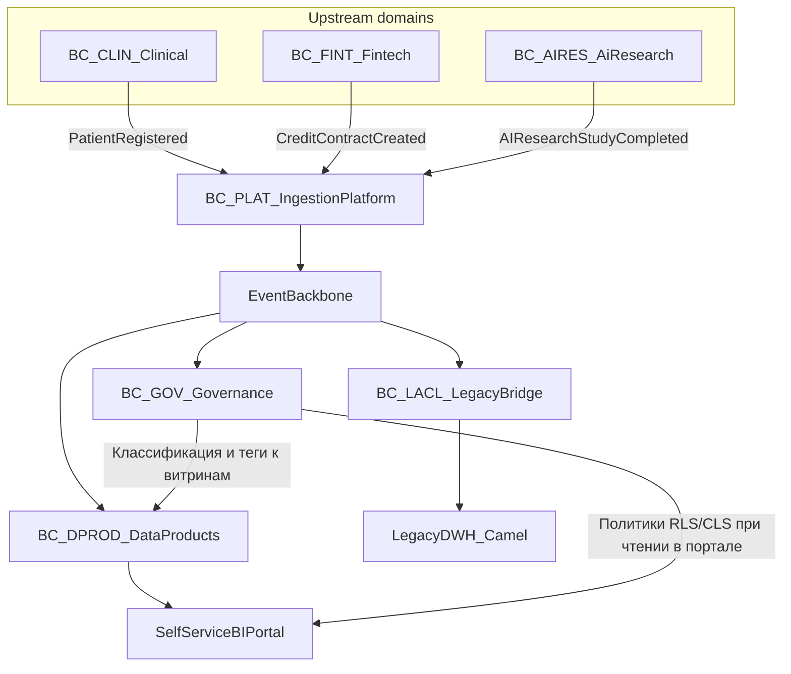

# Bounded contexts — «Будущее 2.0»

## Доменная декомпозиция (ограниченные контексты)

| Context ID | Название | Ответственность (Ubiquitous Language) | Upstream/Downstream |
|------------|----------|----------------------------------------|----------------------|
| BC_CLIN | **Clinical & Patient** | Регистрация пациента, идентификаторы в клинике, демографические атрибуты для операционных процессов. **Клиническая правда** об отношениях «пациент—учреждение». | Публикует `PatientRegistered`; не потребляет из аналитики. |
| BC_FINT | **Fintech & Credit** | Кредитные договоры, статусы, лимиты; соблюдение банковских требований. | Публикует `CreditContractCreated` и последующие события договора. |
| BC_AIRES | **AI & Research Execution** | Запуск/завершение **исследовательских** процедур, статусы, связь с **обезличенным** субъектом исследования при интеграциях, не витриной. | Публикует `AIResearchStudyCompleted` (см. ограничения self-service). |
| BC_DPROD | **Analytics & Data Products** | Потоковая/батчевая сборка data products, слои Bronze/Silver/Gold, агрегаты для self-service, контракты на чтение. | Подписчик к доменным шинам; **не** пропагирует в self-service сырые PHI. |
| BC_GOV | **Data Access & Governance** | Каталог, RLS/CLS, классификация, согласия (где применимо), **политики** выдачи в self-service. | Метаданные и политики: подписка на псевдонимизацию/теги чувствительности. |
| BC_PLAT | **Integration & Ingestion (Platform)** | `API Gateway & Ingestion`: приём, схемы, валидация, маршрутизация в `Event Backbone`. Технический **Published Language** (Avro/JSON). | OHS для внешних поставщиков событий. |
| BC_LACL | **Legacy Anti-Corruption (Camel / DWH)** | Переход: трансляция/синхронизация, ACL над MS SQL 2008 и `Apache Camel`. | Downstream; консьюмит, что нужно, переживая легаси-семантику. |

**Downstream-политика для BC_DPROD:** self-service marts (BC_DPROD → портал) **только** через BC_GOV (см. C4: `Data Access & Governance` + self-service зона).

## Контекстная карта (C4, упрощённо)

`Domain Systems` → `API Gateway & Ingestion` (BC_PLAT) → `Event Backbone` → потребители, включая `Stream Processing` (в составе BC_DPROD) и `Legacy Bridge` (BC_LACL).  
`Data Access & Governance` (BC_GOV) управляет выдачей в `Self-service BI`.

## Mermaid: контексты и «кто публикует / кто подписан»

**Подписчики (по смыслу, не исчерпывающе):**

- `PatientRegistered` → BC_DPROD (обезличенные срезы по потоку пациентов), BC_GOV (аудит политик), BC_LACL (только если в миграции дублируем витрины в MS SQL)
- `CreditContractCreated` → BC_DPROD, BC_GOV, BC_LACL
- `AIResearchStudyCompleted` → BC_DPROD (только **агрегаты/когорты** в self-service, без результатов), BC_AIRES-внутренние сервисы, BC_LACL (по необходимости ACL)

**Запрет (по условиям задания):** события, предназначенные для **сквозного** self-service, **не** содержат: диагноз, текст медкарты, **сырые** результаты исследований. Минимум для аналитики в портале — в `events.md` (маскировка, агрегирование).

## Связь с Task3 (контейнеры)

- **Ingestion** = BC_PLAT.  
- **Event Backbone** = периметр Published Language.  
- **Stream Processing & Data Products** = реализация в BC_DPROD.  
- **Data Access & Governance** = BC_GOV.  
- **Legacy Integration Bridge** = BC_LACL.
