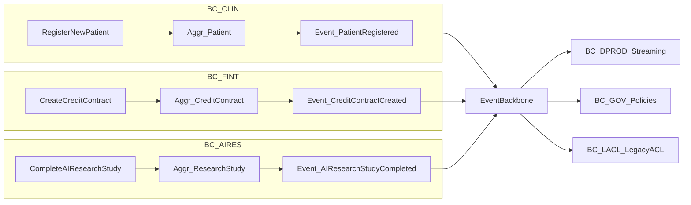

# Event Storming — целевое взаимодействие доменов

Упрощённая **Big Picture** Event Storming для трёх опорных сценариев: пациент, кредит, исследование ИИ. Базовая цепочка: **команда → агрегат → событие**; публикация через BC_PLAT в `Event Backbone` (см. Task3).

Ниже: сценарные потоки; отдельно заданы типичные для Event Storming элементы (политики, read-модели, внешние системы, hot spots) — без сведения всего к одной таблице команд.

## Легенда (по смыслу Event Storming)

| Элемент | В этом артефакте |
|--------|-------------------|
| **Domain event** | `PatientRegistered`, `CreditContractCreated`, `AIResearchStudyCompleted` |
| **Command** | `RegisterNewPatient`, `CreateCreditContract`, `CompleteAIResearchStudy` |
| **Hot spot** | Риск утечки PII, несогласованности исследований, перегруз легаси-DWH; в каждом сценарии — **«Горячая зона»** |
| **Policy** | `patientId` **только** **в** закрытом контуре; **в** аналитике — `patientPseudoId` (BC_GOV, Policy Enricher); **запрет** сырья в self-service — см. `events.md` |
| **Read model** | Проекции BC_DPROD (витрины, `MartSnapshot`), **после** RLS/CLS; **отдельно** **от** операционного агрегата `Patient` |
| **Внешняя система** | Регистратура/EMR, банк. **ядро**, PACS/ИИ — источник команд **или** цель легаси-sync |
| **Process / сага** | Пример: отмена/закрытие кредитного сценария **по цепочке событий скоринга** (BC_FINT); **часто остаточно** EDA **без центрального оркестра** |

**Глоссарий id:** `patientId` (только BC_CLIN/ACL) / `patientPseudoId` (аналитика, self-service) / `anonymizedSubjectId` (ИИ) — см. `events.md`.

## Сценарий 1: регистрация нового пациента

1. **Команда:** `RegisterNewPatient`  
2. **Агрегат:** `Patient` (BC_CLIN)  
3. **Инвариант (пример):** в рамках одной клиники уникален **операционный** идентификатор/номер.  
4. **Доменное событие:** `PatientRegistered` (публикуется **после** фиксации в контексте)  
5. **Подписчики:** BC_DPROD (сегменты по потоку, обезличивание), BC_GOV (политики, аудит), BC_LACL (фаза миграции, опционально).

- **Внешние системы:** касса/регистратура, EMR — источник команды или фиксация **после** `PatientRegistered`.  
- **Read model:** витрины по `patientPseudoId` и срезу `clinicId` (агрегаты по потоку), **без** операционного `patientId` в self-service-схеме.  
- **Policy:** псевдоним **до** шины выдаёт BC_GOV / Policy Enricher; профили A и B в `events.md`.  
- **Hot spot:** одна схема, где **и** `patientId` **и** `patientPseudoId` доступны self-service-консьюмерам — риск трактовки **как** утечка; нужны **раздельные** топики/профили.

## Сценарий 2: кредитный договор

1. **Команда:** `CreateCreditContract` (или `IssueCreditForCustomer`)  
2. **Агрегат:** `CreditContract` (BC_FINT)  
3. **Инварианты (примеры):** валюта, лимит, срок, статус оформления, привязка к контрагенту/счёту.  
4. **Событие:** `CreditContractCreated`  
5. **Подписчики:** BC_DPROD (фин. витрины, риск), BC_GOV (теги регуляторки), BC_LACL (трансфер в DWH, пока требуется).

- **Внешние системы:** ABS, продуктовый сервис, KYC, **легаси**-справочники.  
- **Read model:** витрина/проекция риска по `contractId`, срезы по продукту и дате.  
- **Process (пример):** при отклонении скоринга после `CreditContractCreated` возможны отдельные FSM-события (сага/откат) — **здесь** **не** раскрываем.  
- **Hot spot:** двойной учёт сумм и PII **в** Camel **и** **в** **потоке** **без** **синхронизации** **с** **агрегатом** `CreditContract` **в** BC_FINT.

## Сценарий 3: завершение исследования (ИИ / лаб. контур)

1. **Команда:** `CompleteAIResearchStudy`  
2. **Агрегат:** `ResearchStudy` / `StudyRun` (BC_AIRES)  
3. **Инварианты (примеры):** **обязательно** `studyId`, статус completed; **субъект** исследования — **обезличенный** идентификатор при выходе за пределы сырого клин. контура, если внешние границы.  
4. **Событие:** `AIResearchStudyCompleted` (аналог требования **«Пройдено исследование ИИ»**)  
5. **Подписчики:** внутри BC_AIRES, BC_DPROD (только **согласованные** поля: время, когорта, категория, без результата в self-service), BC_LACL (ограниченно).

- **Внешние системы:** PACS/лаб. RIS, **GPU-инференс** в BC_AIRES; **снаружи** self-service-витрин.  
- **Read model:** когорты по `anonymizedSubjectId` + `modality` + `completedAt` **без** содержимого исследования в портале.  
- **Policy:** к self-service-консьюмерам — **только** **метаданные**; сырьё — в **закрытом** topic.  
- **Hot spot:** смешение `patientId` **и** `anonymizedSubjectId` (роли — в `events.md`); **результаты** **исследований** **в** self-service **недопустимы** **по** **условиям** **задания**.

## Оранжевые/красные зоны (внимание)

- **PHI/PII** и **результаты исследований** не должны **по умолчанию** дублироваться в легаси-отчётах, если нет **явного** DLP/согласия.  
- **Policy Enricher / Schema Validator** (Task3, компонент Ingestion) = **технические** механизмы BC_PLAT; **бизнес-инварианты** — в исходных агрегатах (BC_*).

## Mermaid: поток (упрощённо)

