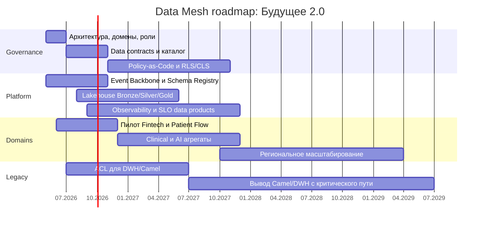

# Roadmap внедрения Data Mesh

Roadmap привязан к бизнес-целям кейса: за 2 месяца согласовать архитектуру и границы доменов, за 1 год запустить self-service для бизнес-пользователей, за 3 года масштабировать продукты, регионы и near-real-time работу с данными.

## Целевое состояние через 3 года

- Данные принадлежат доменам: Clinical & Patient, Fintech & Credit, AI & Research, Analytics & Data Products, Data Access & Governance.
- Каждый критичный домен публикует data products с владельцем, контрактом, SLA качества, схемой и классификацией данных.
- Self-service BI работает поверх разрешенных обезличенных/агрегированных витрин; медицинские карты, истории болезни и сырые результаты исследований не попадают в портал.
- DWH и Camel остаются только как совместимость на период миграции или выводятся из критического пути.
- Новые направления, регионы и источники подключаются через data contracts, события и каталог, а не через перенос логики в центральный DWH.

## Роли и ответственность

| Роль                        | Ответственность                                                                                                    |
|-----------------------------|--------------------------------------------------------------------------------------------------------------------|
| Data Product Owner          | Владелец ценности data product в домене: приоритеты, пользователи, SLA, качество, принятие изменений контракта.    |
| Data Engineer               | Реализует ingestion, pipelines, stream processing, проверки качества, публикацию Bronze/Silver/Gold data products. |
| BI-аналитик                 | Проектирует self-service-модели, semantic layer, метрики и отчеты для бизнес-пользователей.                        |
| Domain Architect            | Следит за границами bounded contexts, published language, совместимостью с C4/DDD и миграцией легаси.              |
| Platform Engineer           | Поддерживает event backbone, lakehouse, CI/CD, Terraform-модули, observability, шаблоны data products.             |
| Data Governance Lead        | Управляет каталогом, классификацией, доступами, lineage, RLS/CLS, правилами PHI/PII.                               |
| Security/Compliance Officer | Проверяет медицинские и финансовые контуры, аудит доступа, требования регуляторов и policy-as-code.                |
| SRE/DataOps                 | Отвечает за SLO, мониторинг freshness/lag/DLQ, incident response и capacity planning.                              |

## Этапы внедрения

| Этап                                 | Горизонт         | Фокус                                                                                                      | Ключевые результаты                                                                                               | Бизнес-цель                                                                                        |
|--------------------------------------|------------------|------------------------------------------------------------------------------------------------------------|-------------------------------------------------------------------------------------------------------------------|----------------------------------------------------------------------------------------------------|
| 0. Подготовка и governance baseline  | 0-2 месяца       | Согласование целевой архитектуры, границ доменов, стандартов событий и data products.                      | Утверждены домены, роли, принципы data contracts, классификация данных, стартовый backlog пилотов.                | Дать руководству согласованное архитектурное решение и план перехода.                              |
| 1. Пилот Data Mesh                   | 0-6 месяцев      | Запуск 1-2 доменов: Fintech & Credit и Patient Flow без PHI в self-service.                                | Event Backbone, Schema Registry, Data Catalog, первые data products, DLQ/replay, метрики freshness и качества.    | Показать работоспособность near-real-time подхода и снизить зависимость от DWH для первых отчетов. |
| 2. Масштабирование критичных доменов | 6-18 месяцев     | Подключение Clinical aggregates, AI & Research aggregates, finance reporting; ACL для Camel/DWH.           | Потоковые витрины, semantic layer, RLS/CLS, lineage, регулярные contract tests, расширенный портал self-service.  | За 1 год дать бизнес-пользователям новую архитектуру данных и управляемый self-service.            |
| 3. Промышленная эксплуатация         | 18-36 месяцев    | Вывод Camel/DWH с критического пути, стандартизация data products, поддержка регионов и новых направлений. | Большинство критичных отчетов работает на data products; DWH не содержит новой логики; домены управляют cost/SLO. | Поддержать рост продуктов, регионов и источников без централизации всей логики в DWH.              |
| 4. Непрерывное улучшение             | После 36 месяцев | Оптимизация стоимости, расширение AI/embedded analytics, зрелый FinOps и governance.                       | Регулярный пересмотр tech radar, TCO, SLO и качества данных; оценка Feature Store и внешних data products.        | Удерживать масштабируемость и экономику платформы при росте бизнеса.                               |

## Диаграмма этапов

## План по фазам

### 0-2 месяца: согласование и запуск управления

| Направление | Действия                                                                                                                  | Результат                                                                                            |
|-------------|---------------------------------------------------------------------------------------------------------------------------|------------------------------------------------------------------------------------------------------|
| Архитектура | Утвердить домены, bounded contexts, published language, правила событий и целевой tech radar.                             | Команды используют единый архитектурный словарь и не проектируют новые связи через DWH по умолчанию. |
| Governance  | Назначить Data Governance Lead, Data Product Owner для пилотных доменов, описать классификацию PHI/PII/финансовых данных. | Есть правила, какие данные могут попадать в self-service, а какие остаются в закрытом контуре.       |
| Platform    | Подготовить Terraform/CI/CD шаблоны, окружения, базовый event backbone и каталог схем.                                    | Пилотные команды не создают инфраструктуру вручную.                                                  |
| Экономика   | Завести FinOps-теги по доменам и baseline текущих затрат DWH/Camel/BI.                                                    | TCO можно отслеживать не только как план, но и по фактическим затратам.                              |

### 0-6 месяцев: пилот

| Направление      | Действия                                                                                                          | Результат                                                                                     |
|------------------|-------------------------------------------------------------------------------------------------------------------|-----------------------------------------------------------------------------------------------|
| Fintech & Credit | Опубликовать `CreditContractCreated`, подготовить кредитный data product и метрики по портфелю.                   | Первые финтех-отчеты строятся через события и data product, а не через новую логику в DWH.    |
| Patient Flow     | Опубликовать обезличенный профиль `PatientRegistered` с `patientPseudoId`, собрать агрегаты по потокам пациентов. | Self-service получает допустимые срезы без медицинских карт и сырых результатов исследований. |
| Platform         | Ввести Schema Registry, DLQ, replay, monitoring lag/freshness, шаблон data product.                               | Риски несовместимых схем и долгой диагностики снижаются техническими контролями.              |
| Adoption         | Обучить пилотные команды DDD/EDA/Data Mesh, провести первые architecture review.                                  | Команды понимают, где границы домена и кто владеет data product.                              |

### 6-18 месяцев: масштабирование

| Направление      | Действия                                                                                                                   | Результат                                                                       |
|------------------|----------------------------------------------------------------------------------------------------------------------------|---------------------------------------------------------------------------------|
| Clinical & AI    | Добавить только разрешенные агрегаты и обезличенные события для аналитики; сырые исследования оставить в закрытом контуре. | AI/clinical-направления участвуют в аналитике без нарушения ограничения по PHI. |
| BI/self-service  | Развернуть semantic layer, RLS/CLS, каталог отчетов и обучение BI-аналитиков.                                              | Пользователи конструируют отчеты в пределах прав доступа.                       |
| Legacy migration | Построить ACL для DWH/Camel, перенести критичные batch-ETL в доменные pipelines.                                           | Легаси работает как мост совместимости, а не как место новой бизнес-логики.     |
| Operating model  | Ввести quarterly data product review: usage, freshness, cost, incidents, contract changes.                                 | Data products управляются как продукты с метриками ценности и качества.         |

### 18-36 месяцев: промышленная эксплуатация и рост

| Направление                  | Действия                                                                                                              | Результат                                                                              |
|------------------------------|-----------------------------------------------------------------------------------------------------------------------|----------------------------------------------------------------------------------------|
| Региональное масштабирование | Подключить 2-3 региона через повторяемые шаблоны домена, data contracts и политики доступа.                           | Расширение географии не требует переписывать центральный DWH.                          |
| Новые направления            | Подключать фармацевтические компании и медоборудование через onboarding-процесс: schema, owner, SLA, classification.  | Новые источники быстрее становятся управляемыми data products.                         |
| Cost optimization            | Оптимизировать storage lifecycle, compute autoscaling, consumer groups, retention, FinOps по доменам.                 | Run-rate целевой архитектуры снижается после миграционного пика.                       |
| Legacy exit                  | Закрыть критичные зависимости от PowerBuilder/Camel/DWH; оставить только архивные или юридически необходимые контуры. | Целевая архитектура соответствует трехлетней цели слабосвязанной событийной платформы. |

## Метрики успеха

| Метрика                                                 | Цель                                                                     |
|---------------------------------------------------------|--------------------------------------------------------------------------|
| Доля критичных отчетов, построенных на data products    | 60%+ к 18 месяцам, 85%+ к 36 месяцам                                     |
| Доля критичных междоменных интеграций на Event Backbone | 50%+ к 18 месяцам, 90%+ к 36 месяцам                                     |
| Время подготовки типового отчета                        | Сокращение с часов до минут для приоритетных self-service сценариев      |
| Доля доменов с назначенным Data Product Owner           | 100% критичных доменов к 6 месяцу                                        |
| Контрактные нарушения событий                           | Тренд к снижению; все breaking changes проходят review и версионирование |
| Freshness data products                                 | SLA задан для каждого продукта; нарушения видны в observability          |
| Доля новой бизнес-логики, добавленной в DWH             | 0% для новых продуктов после запуска пилота                              |
| Adoption self-service                                   | Рост активных пользователей портала и снижение ручных заявок аналитикам  |

## Зависимости и контрольные точки

| Контрольная точка               | Срок       | Критерий готовности                                                                                  |
|---------------------------------|------------|------------------------------------------------------------------------------------------------------|
| Architecture baseline approved  | 2 месяца   | Утверждены домены, роли, tech radar, правила PHI/PII, backlog пилота.                                |
| Pilot data products live        | 6 месяцев  | Есть работающие Fintech и Patient Flow data products, каталог, схемы, DLQ, мониторинг.               |
| Self-service production release | 12 месяцев | Бизнес-пользователи строят отчеты через портал по разрешенным data products.                         |
| Legacy critical path reduction  | 18 месяцев | Критичные витрины переведены на доменные pipelines; Camel/DWH не расширяются новой логикой.          |
| Target operating model          | 36 месяцев | Data Mesh работает как штатная модель: владельцы, SLO, FinOps, governance, onboarding новых доменов. |
